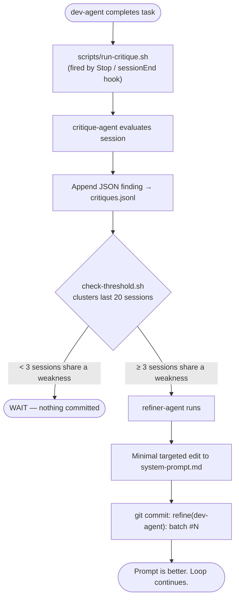
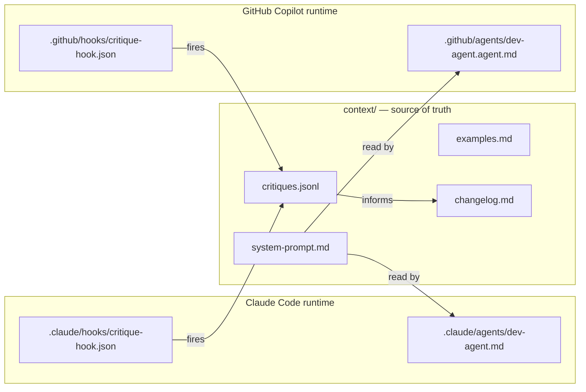
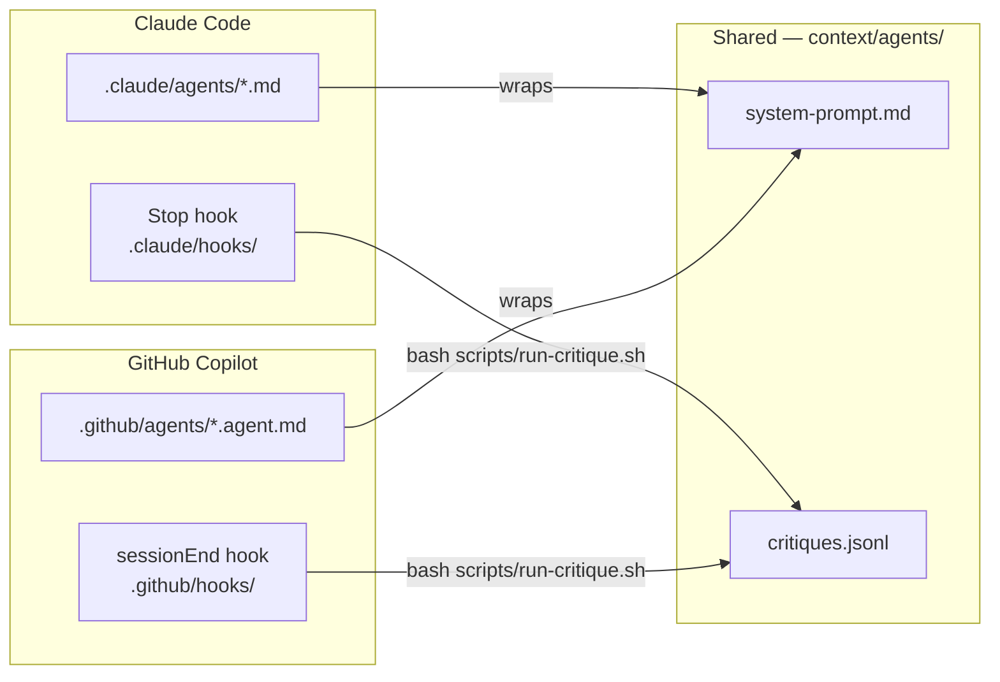

# reflexloop

> AI coding agents that get better through use — automatically.

## Why this exists

Every AI coding agent I've used starts strong. Then it makes the same mistake twice. Three times. You patch it manually, write it in a doc nobody reads, and a week later it's back.

The problem isn't the model. It's that the instructions we give agents — system prompts — are written once and never updated. They have no memory of what actually went wrong.

reflexloop closes that loop. After every session, a critique agent asks what went wrong and why the prompt allowed it. Those observations accumulate. When the same gap appears enough times, the prompt is updated automatically — and the change is committed to git so you can see exactly when and why the agent got better.

## Example outcome

After 15 sessions on a Node.js service, `dev-agent` had accumulated 4 critiques flagging the same gap: it never checked for existing DB migrations before writing new ones. Batch #2 added one sentence to the system prompt:

> "Before writing a migration file, check for existing migrations in the db/migrations/ folder to avoid naming conflicts."

No rollback incidents in the next 20 sessions. The commit is in git. The change took 8 tokens.

## How it works

### The loop



### Agent architecture



### Runtime wiring



| Step | Claude Code | GitHub Copilot |
|------|------------|----------------|
| Hook fires after session | `Stop` hook in `.claude/hooks/` | `sessionEnd` in `.github/hooks/` |
| Agent definitions | `.claude/agents/*.md` | `.github/agents/*.agent.md` |
| Sequential handoff | subagent call | `handoffs` config |
| Source of truth | `context/agents/` | `context/agents/` (shared) |

The `context/` folder is runtime-agnostic. Both Claude Code and Copilot read from the same system prompts and write to the same critique log.

## Agents

| Agent | Role | Source of truth |
|-------|------|-----------------|
| `dev-agent` | TDD-first coding: plan → test → implement → verify → summarise | `context/agents/dev-agent/system-prompt.md` |
| `critique-agent` | Evaluates output, traces failures to prompt gaps, emits structured JSON | `context/agents/critique-agent/system-prompt.md` |
| `refiner-agent` | Applies one targeted fix per batch, can spawn new specialised agents | `context/agents/refiner-agent/system-prompt.md` |

**Never edit `.claude/agents/` or `.github/agents/` directly.** These are thin adapters. Edit the context files.

## 5-minute quickstart

### 1. Clone and inspect

```bash
git clone https://github.com/nayyarsan/reflexloop
cd reflexloop
```

### 2. Run the test suite to confirm everything works

```bash
bash tests/validate-structure.sh
bash tests/validate-agent-prompts.sh
bash tests/validate-hooks.sh
bash tests/test-check-threshold.sh
bash tests/test-run-critique.sh
bash tests/test-integration.sh
```

Expected: all green.

### 3. Copy agent files into your project

**Claude Code:**

```bash
cp -r .claude/agents/ /path/to/your-project/.claude/agents/
cp -r .claude/hooks/ /path/to/your-project/.claude/hooks/
cp -r context/ /path/to/your-project/context/
cp -r scripts/ /path/to/your-project/scripts/
```

**GitHub Copilot:**

```bash
cp -r .github/agents/ /path/to/your-project/.github/agents/
cp -r .github/hooks/ /path/to/your-project/.github/hooks/
cp -r .github/skills/ /path/to/your-project/.github/skills/
cp -r context/ /path/to/your-project/context/
cp -r scripts/ /path/to/your-project/scripts/
```

### 4. Trigger a critique manually (no hook needed)

```bash
bash scripts/run-critique.sh my-first-session dev-agent
```

This runs in DRY_RUN mode if `claude` CLI is not authenticated. Check the output:

```bash
cat context/agents/dev-agent/critiques.jsonl
```

### 5. Check the threshold

```bash
bash scripts/check-threshold.sh dev-agent
```

Output: `WAIT` (not enough sessions yet) or `REFINE` (a batch is ready).

### 5b. Compress a prompt (optional)

If a prompt has grown through many refinements, run a compression pass:

```bash
bash scripts/refactor-prompt.sh dev-agent
```

This prints a structured prompt to pass to `refiner-agent` in compression-only mode: it merges overlapping rules, removes duplicates, and simplifies wording — without adding new constraints.

### 6. Inspect the status dashboard

```bash
bash scripts/print-status.sh dev-agent
```

Shows: total sessions, critique clusters, last refinement batch, current threshold settings, and current prompt word count vs the ≤1,200 token budget.

## Runtime integration

### Claude Code

**How sessions are identified:**
The `CLAUDE_SESSION_ID` environment variable is set automatically by Claude Code for each session. The `Stop` hook in `.claude/hooks/critique-hook.json` passes it to `run-critique.sh`.

**Installing the hook:**
The hook file at `.claude/hooks/critique-hook.json` is picked up automatically when Claude Code runs in your project directory. No additional configuration needed.

**Where the Stop hook fires:**
After every Claude Code session ends — whether the task completed, errored, or was cancelled. This means every session generates a critique entry, including failed ones (which are often the most informative).

**Verifying it's wired:**

```bash
# After a Claude Code session, check:
tail -1 context/agents/dev-agent/critiques.jsonl | python -m json.tool
```

---

### GitHub Copilot

**How sessions are identified:**
The `COPILOT_SESSION_ID` variable is set by the Copilot agent runtime. The `sessionEnd` hook in `.github/hooks/critique-hook.json` captures it.

**Configuring handoffs (optional):**
The `dev-agent.agent.md` file includes three handoff actions:
- **Run critique** — manually trigger critique-agent on the current session
- **Refine dev-agent prompt** — runs `check-threshold.sh` and applies a fix if threshold is crossed
- **Refactor dev-agent prompt** — compression-only pass: merges redundant rules, removes duplicates, no new constraints added

These complement the automatic `sessionEnd` hook — useful for debugging or on-demand prompt maintenance.

**Running scripts in VS Code:**
Open the integrated terminal and run `bash scripts/run-critique.sh <session-id> dev-agent` directly. The scripts have no IDE-specific dependencies.

**Verifying sessionEnd is wired:**
Check `.github/hooks/critique-hook.json` is on your repo's default branch — Copilot coding agent only reads hooks from the default branch.

## Use cases in SDLC

### Prompt regression safety net

When you update an agent's system prompt manually, the existing critique log will detect regressions — if the next 3 sessions re-surface a weakness you thought you'd fixed, the threshold will trigger again. Think of it as unit tests for agent behaviour.

### Encoding org standards

Use `refiner-agent` as the enforcer of your team's coding standards. If the dev-agent consistently skips security reviews, that gap gets written into the prompt automatically. Standards stop living in wikis nobody reads.

### Capturing tribal knowledge

Every critique entry in `critiques.jsonl` is a structured record of what the agent got wrong and why. Over time this becomes an audit trail of what your team considers good output — more useful than a style guide because it's tied to real failures.

### Recipes

**Guardrail on Copilot for PR-driven teams:**
Add a CI step that runs `bash tests/validate-agent-prompts.sh` on every PR. It checks that all required sections are present and that no prompt exceeds `MAX_LINES` (default: 80). If a refinement commit removes a required section or causes prompt bloat, the check fails before merge.

**Trunk-based development with ephemeral branches:**
Because the critique pipeline writes to `context/agents/` rather than the agent adapter files, refinement commits are clean and easy to cherry-pick or rebase. The JSONL log stays on trunk; agent improvements merge naturally.

### Process maturity angle

Reflexloop is to agent prompts what static analysis is to code — a lightweight continuous-improvement loop that runs automatically, catches regressions, and leaves an auditable trail. You don't change your workflow. You just add a layer that watches and adapts.

## Safety model

**Minimal diffs:** `refiner-agent` is instructed to make one change per batch — a single added constraint, a rewritten step, or one new example. It cannot rewrite an entire prompt.

**Threshold gating:** Refinements only trigger when the same weakness appears in ≥3 sessions (configurable). A single bad session never changes a prompt.

**Severity gate:** The refiner only promotes `major` or `moderate` findings to prompt changes. `minor` findings are skipped unless no higher-priority work exists, preventing stylistic noise from drifting into prompts.

**Token budget:** System prompts are capped at ≤1,200 tokens / ≤80 lines. When a prompt approaches the limit, the refiner is instructed to merge or compress existing rules rather than append. Run `scripts/refactor-prompt.sh <agent>` for an on-demand compression pass. `validate-agent-prompts.sh` enforces this limit as a hard CI check.

**Accumulation slot:** Each system prompt has a `## Project-local rules` section — a dedicated slot where the refiner writes accumulated project-specific constraints, keeping the core `## Constraints` section stable and readable.

**Avoiding overfitting:** The `WINDOW` variable (default: 20) limits how far back clustering looks. Old critiques age out so a historical pattern doesn't override recent good behaviour.

**Pinning prompt sections:** Wrap any section you want to lock with an HTML comment:

```markdown
<!-- LOCKED: do not modify -->
## Security constraints
...
<!-- END LOCKED -->
```

`refiner-agent`'s instructions tell it to never modify content between LOCKED markers.

**Rolling back:** Every refinement is a git commit. Roll back with:

```bash
git revert <refinement-commit-sha>
```

The `changelog.md` tells you which batch each commit corresponds to.

**User feedback trust model:** Ratings ≤2 re-trigger critique but the critique-agent independently decides whether to incorporate the feedback. A user preferring `var` over `const` will never weaken the prompt.

## Configuration

| Variable | Default | Description |
|----------|---------|-------------|
| `THRESHOLD` | 3 | Sessions with same weakness before refinement triggers |
| `WINDOW` | 20 | How many recent sessions to look at |
| `DRY_RUN` | 0 | Set to 1 to skip LLM calls (for testing) |
| `MAX_LINES` | 80 | Max non-blank lines per system prompt (enforced by `validate-agent-prompts.sh`) |

Override inline:

```bash
THRESHOLD=5 WINDOW=30 bash scripts/check-threshold.sh dev-agent
```

## FAQ

**Do I need CI?**
No. The critique loop runs locally via hooks. CI integration is optional and adds regression checks on prompt changes.

**Does this change my code?**
No. reflexloop only modifies files in `context/agents/` — system prompts, examples, critique logs, and changelogs. Your source code is never touched by the critique pipeline.

**How do I roll back a bad refinement?**

```bash
git log --oneline context/agents/dev-agent/  # find the commit
git revert <sha>
```

**What if the claude CLI isn't available?**
`run-critique.sh` falls back to a placeholder entry so the pipeline doesn't crash. Refinements won't trigger until real critique data accumulates.

**How do I add a new agent?**
See CONTRIBUTING.md — adding a new agent takes about 10 minutes and follows a template.

**How do I lock part of a prompt from being changed?**
Wrap it in `<!-- LOCKED -->` ... `<!-- END LOCKED -->` markers. See Safety model above.

**What's the token cost?**
One critique call per session (the transcript + system prompt → JSON output). One refiner call when threshold is crossed. Both are short-context operations.

## Research basis

| Paper | Design decision it informs |
|-------|---------------------------|
| [Self-Refine (2303.17651)](https://arxiv.org/abs/2303.17651) | The generate → critique → refine loop. We separate the three agents instead of using one model for all roles, which gives cleaner accountability. |
| [Agentic Context Engineering (2510.04618)](https://arxiv.org/abs/2510.04618) | The `context/` folder as an evolving playbook. Contexts accumulate strategies incrementally rather than being rewritten wholesale. |
| [AgentDevel (2601.04620)](https://arxiv.org/abs/2601.04620) | Single canonical version line + regression awareness. We never branch the prompt — one file, one history, non-regression as a first-class constraint. |
| [AgentEvolver (2511.10395)](https://arxiv.org/abs/2511.10395) | Efficient lifecycle: not every session triggers a rewrite. The threshold + window model comes from efficiency-first evolution. |
| [EvolveR (2510.16079)](https://arxiv.org/abs/2510.16079) | Experience-driven improvement: critique entries are structured experience records, not just logs. |

## Contributing

See [CONTRIBUTING.md](CONTRIBUTING.md) for how to add a new agent type, a new runtime, or an enterprise template.

## License

MIT
